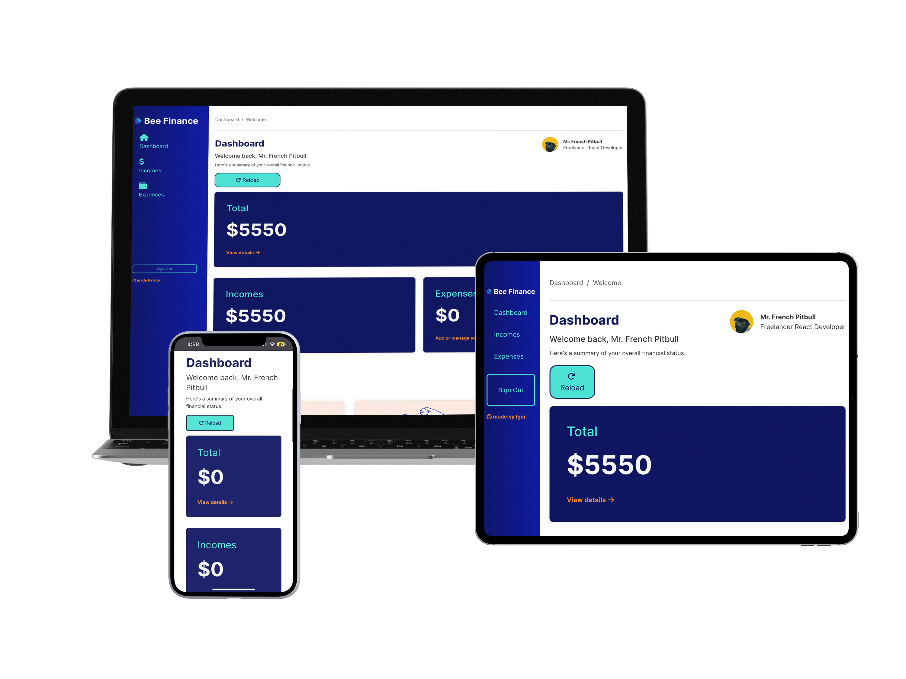
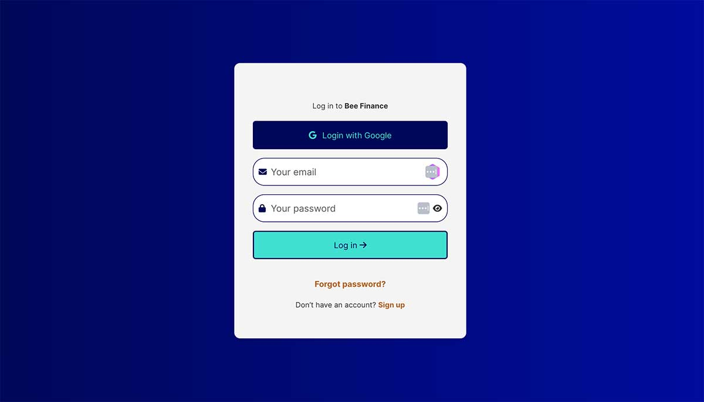
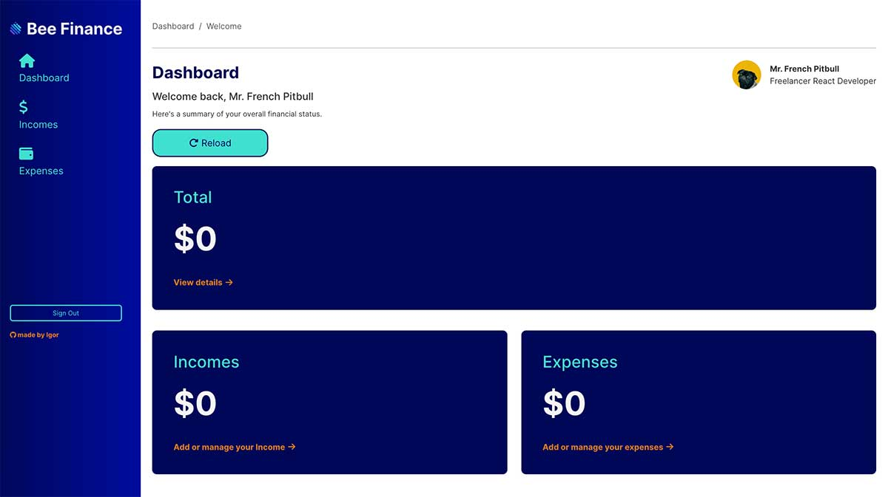
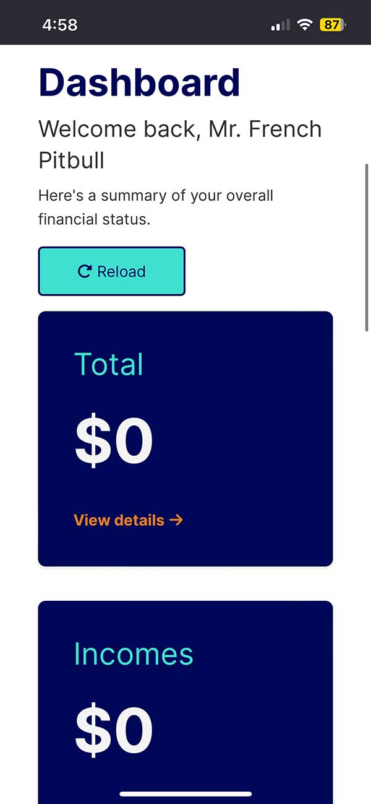
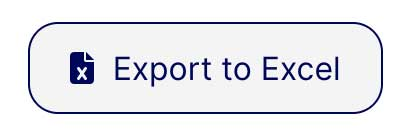
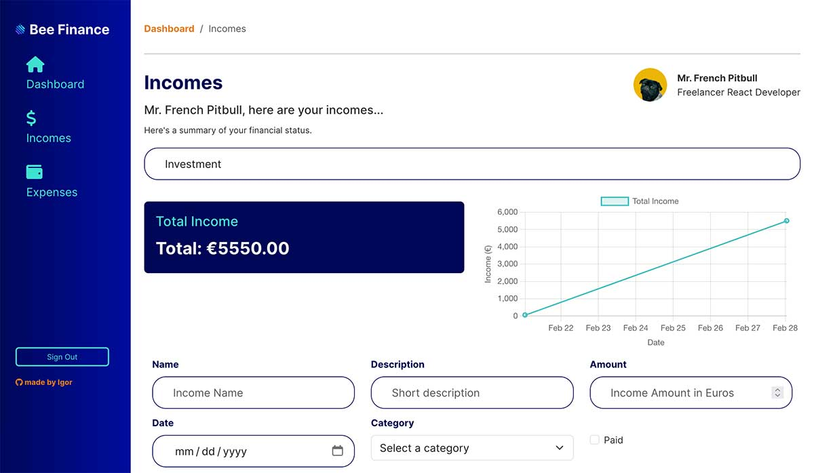
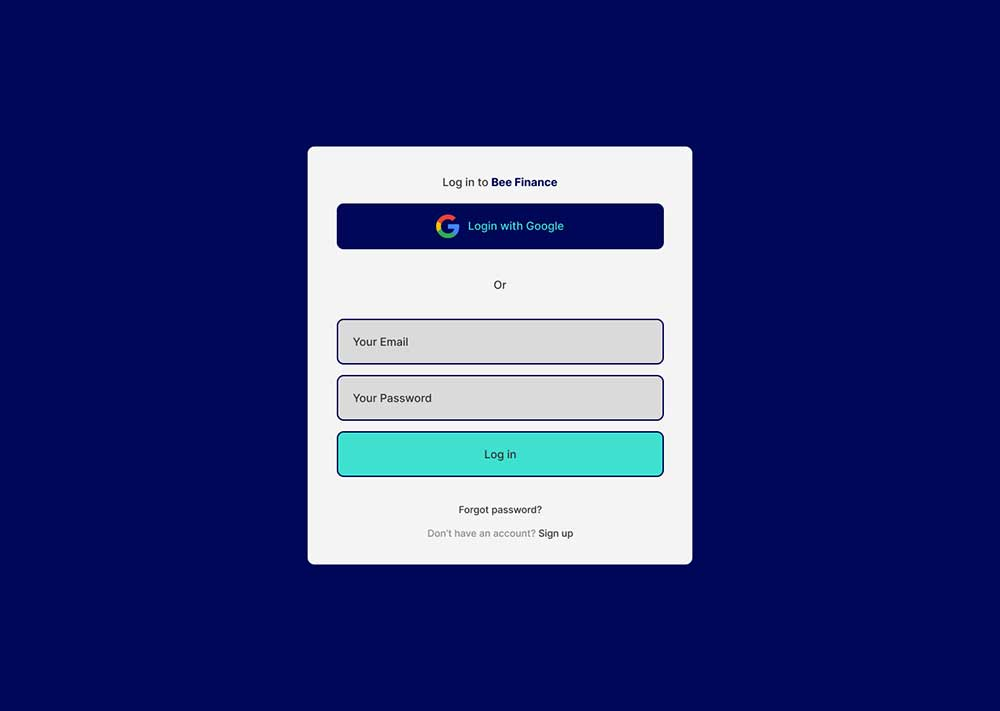
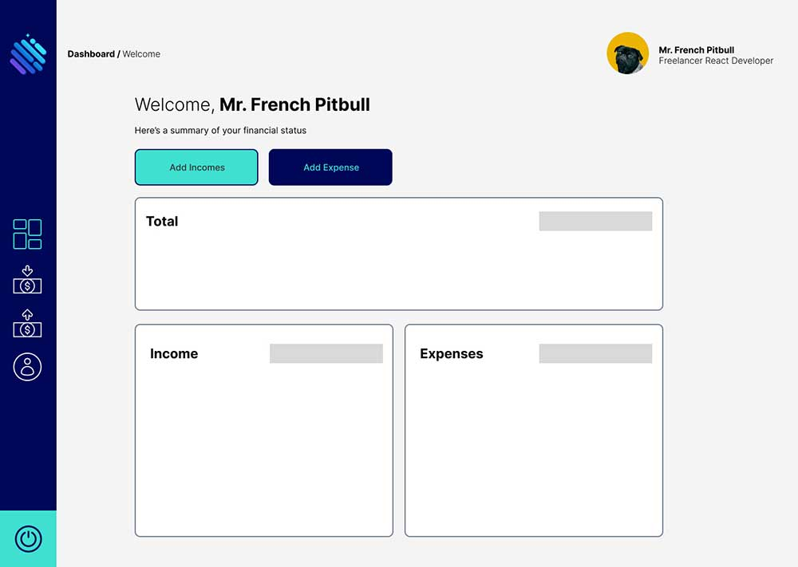
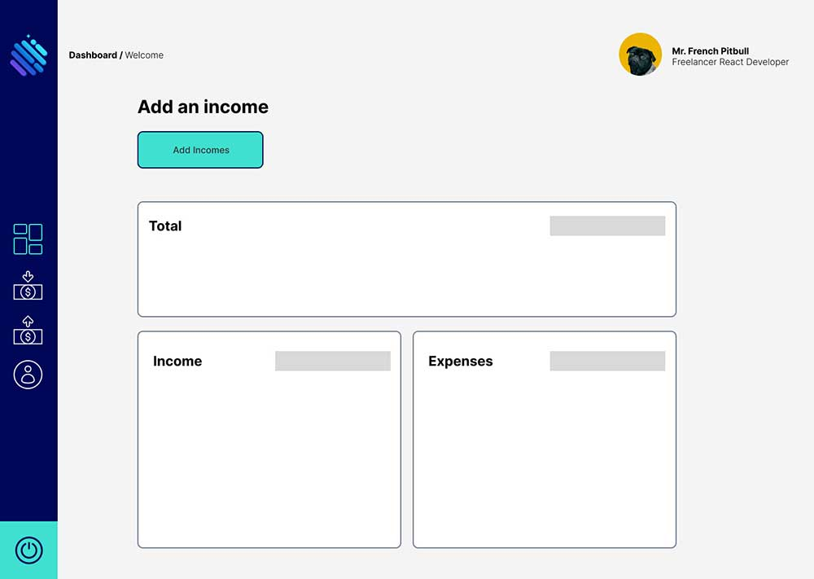
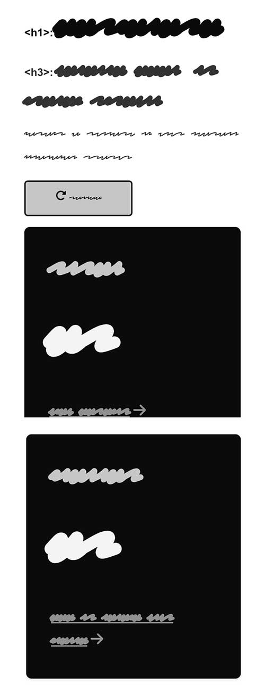

# Budget Management System



A sophisticated React-based application crafted to empower users with efficient budget management capabilities. This system streamlines the process of tracking incomes and expenses, providing insights into financial trends, and fostering a proactive approach to personal finance management.

[Live page here](https://igordinuzzi.github.io/budget-management-system-react/)

## Features

### User Authentication

- **Secure Login**: Offers a dual authentication mechanism, allowing users to sign in using their email or through Google, ensuring a secure access gateway to their financial data.


 
```javascript
function SignIn() {
  const navigate = useNavigate();
  const [email, setEmail] = useState('');
  const [password, setPassword] = useState('');
  const [showPassword, setShowPassword] = useState(false);
  const [loading, setLoading] = useState(false);
  const [error, setError] = useState({ email: '', password: '' });

  const validateForm = () => {
    let formIsValid = true;
    let errors = {};

    // Example validation logic
    if (!email) {
      errors.email = 'Email is required';
      formIsValid = false;
    } else if (!/\S+@\S+\.\S+/.test(email)) {
      errors.email = 'Email is invalid';
      formIsValid = false;
    }

    if (!password) {
      errors.password = 'Password is required';
      formIsValid = false;
    } else if (password.length < 6) {
      errors.password = 'Password must be at least 6 characters';
      formIsValid = false;
    }

    setError(errors);
    return formIsValid;
  }
```

### Dashboard Overview

- **Financial Summary**: Presents a dynamic dashboard that aggregates total incomes and expenses, offering a quick snapshot of the user's current financial standing.
- **Trend Visualization**: Incorporates graphical representations to depict financial trends over time, facilitating an intuitive understanding of income and expense patterns.




  
```javascript
function Dashboard({ totalIncomes, totalExpenses }) {
  // Calculate the total financial data
  const total = totalIncomes + totalExpenses;

  // Function to reload the page
  const handleReload = () => {
    window.location.reload();
  };
```

### Income and Expense Management

- **CRUD Operations**: Users can effortlessly add, modify, and delete income and expense records, enabling precise financial tracking.
- **Categorization**: Each income and expense entry can be categorized, allowing for organized financial management and easier analysis.
- **Date and Amount Tracking**: Records include essential details such as amount, date, and a brief description, ensuring comprehensive financial documentation.


```javascript
function Incomes() {
  const [incomes, setIncomes] = useState(() => {
    const savedIncomes = localStorage.getItem('incomes');
    return savedIncomes ? JSON.parse(savedIncomes) : [];
  });
  const [name, setName] = useState('');
  const [amount, setAmount] = useState('');
  const [date, setDate] = useState('');
  const [description, setDescription] = useState('');
  const [isPaid, setIsPaid] = useState(false);
  const [editing, setEditing] = useState(false);
  const [currentIncome, setCurrentIncome] = useState(null);
  const [currentPage, setCurrentPage] = useState(1);
  const [incomesPerPage] = useState(5);
  const [category, setCategory] = useState('');
  const [searchQuery, setSearchQuery] = useState('');

  const categories = ['Salary', 'Freelance', 'Investment', 'Other'];

  useEffect(() => {
    localStorage.setItem('incomes', JSON.stringify(incomes));
  }, [incomes]);
```

### Data Persistence and Security

- **Local Storage Utilization**: Utilizes the browser's localStorage to securely store financial data on the user's device, ensuring data persistence between sessions without compromising privacy.
- **Data Backup and Recovery**: Encourages users to export their data periodically as a backup measure, safeguarding against data loss.
```javascript
    const savedIncomes = localStorage.getItem('incomes');
```

### Data Visualization

- **Interactive Charts**: Leverages Chart.js to render interactive and customizable charts, offering users a visual analysis tool to monitor financial growth or detect concerning trends.


```javascript
  const chartOptions = {
    scales: {
      x: {
        type: 'time',
        time: {
          unit: 'day',
        },
        title: {
          display: true,
          text: 'Date',
        },
      },
      y: {
        title: {
          display: true,
          text: 'Income (€)',
        },
      },
    },
  };
    <Col md={6}>
    <div className="chart-container">
      <Line data={chartData} options={chartOptions} />
    </div>
  </Col>
```

### Export Functionality

- **Excel Export**: Enables users to export their financial data to Excel format, providing the flexibility to perform detailed analyses or maintain records outside the application.


 
```javascript
  const exportToExcel = () => {
    const ws = XLSX.utils.json_to_sheet(incomes);
    const wb = XLSX.utils.book_new();
    XLSX.utils.book_append_sheet(wb, ws, "Incomes");
    XLSX.writeFile(wb, "Incomes.xlsx");
  };
```

### Search and Filter

- **Efficient Searching**: Incorporates a search functionality that allows users to quickly find specific income or expense entries based on keywords, enhancing the user experience by saving time and effort.
- **Advanced Filtering**: Users can filter their financial records by categories, dates, or amounts, facilitating targeted analysis and helping identify areas for financial improvement.


  
```javascript
  const filteredIncomes = searchQuery.length > 0
    ? incomes.filter(income =>
        income.name.toLowerCase().includes(searchQuery.toLowerCase()) ||
        income.description.toLowerCase().includes(searchQuery.toLowerCase()) ||
        (income.category?.toLowerCase() || '').includes(searchQuery.toLowerCase())
      )
    : incomes;
```

## Framer Motion

Enhanced User Experience with Motion: Leverages Framer Motion, a powerful animation library for React, to create smooth, engaging animations and transitions. This enhances the user interface by providing visual feedback, subtle animations on page transitions, button interactions, and dynamic chart movements, contributing to a more interactive and polished user experience.

### Responsive Design

- **Cross-Device Compatibility**: Designed with a responsive layout to ensure an optimal viewing and interaction experience across a wide range of devices, from desktops to smartphones.
  
  
  

### User Support and Documentation

- **Comprehensive Guide**: Provides detailed documentation and user guides to assist new users in navigating the application and making the most of its features.
- **Community Support**: Encourages an active user community for sharing tips, tricks, and best practices for budget management.

## Next Features

While the Budget Management System provides a robust foundation for personal finance management, there are several enhancements and features planned for future releases to further improve user experience and functionality:

- **Google Sign-Up Integration**: To complement the existing Google sign-in feature, adding Google sign-up will streamline the account creation process, offering users an even more convenient way to get started with the application.
- **Forgot Password Feature**: Implementing a forgot password functionality to assist users in recovering their accounts more seamlessly when they forget their passwords.
- **Advanced Analytics and Insights**: Developing more sophisticated analytics tools to provide deeper insights into spending habits, saving opportunities, and financial forecasting.
- **Customizable Budget Goals**: Allowing users to set and track custom budget goals, helping them stay on track with their financial objectives.
- **Notifications and Reminders**: Introducing notifications for upcoming bills, budget limits, and personalized reminders to ensure users stay informed about their financial status.
- **Multi-Currency Support**: Adding functionality to manage finances in multiple currencies, catering to users who travel frequently or have international financial obligations.
- **Shared Wallets**: Facilitating shared budget management for families or groups, enabling collaborative tracking of joint expenses and incomes.

These upcoming features aim to make the Budget Management System even more versatile and user-friendly, addressing key user needs and enhancing the overall financial management experience.

## Wireframes

[Figma link](https://www.figma.com/file/kFjBaI0JvfGgwchYxaW6bP/Budget-Management-system?type=design&node-id=0%3A1&mode=design&t=prTqJCf04XHz0glx-1)

### Brainstorming

1. **Authentication Screens**
- **Sign In**: Design the login interface where users enter their credentials.

2. **Dashboard**
- **Main Dashboard**: Design an overview screen that displays a summary of the user's financial status, including total income, expenses, and net earnings. Consider including quick access to add income/expenses and view detailed reports.

3. **Income Management**
- **Add Income**: A form to input new income entries, including details like amount, source/client, date, and any notes.
- **Income List/Overview**: Display a list of income transactions, possibly with options to edit, delete, or filter by date/client.

4. **Expense Management**
- **Add Expense**: A form for entering expenses, including amount, category (e.g., software, equipment), date, and notes.
- **Expense List/Overview**: A view to show all expenses, with functionality to edit, delete, or filter entries.

6. **Reports and Analytics**
- **Financial Reports**: Design screens that display financial reports and analytics, such as income vs. expenses, category-wise spending, and earnings by client or project.
- **Budget Tracking**: If including budget features, design screens for setting budgets, tracking progress, and viewing alerts for overages.

7. **Settings and Profile**
- **User Profile**: A screen for users to view and edit their profile information.
- **Settings**: Include options for configuring the application settings, such as notification preferences, account settings, and integration options.

8. **Navigation**
- **Navigation Menu/Sidebar**: Design a navigation system (e.g., a top bar or sidebar) that provides easy access to the various sections of the app like Dashboard, Income, Expenses, Projects, Reports, and Settings.

Additional Considerations
- **Responsive Design**: Consider designing wireframes for different screen sizes to ensure the application is usable on both desktop and mobile devices.
- **Empty States and Loading**: Design screens or components to display when data is loading or when there are no entries (e.g., no expenses added yet).
- **Feedback and Alerts**: Consider how you will show success, error messages, or confirmations (e.g., after adding an income or deleting an expense).

### Low-fidelity 
- **Sign-in**:

- **Dashboard**:


- **Income**:
 

- **Mobile**:
 

```css
@import url('https://fonts.googleapis.com/css2?family=Inter:wght@300;400;700&display=swap');

:root {
  --primary-color: #000758;
  --hover-color: #000D9E;
  --secondary-color: #40E0D0;
  --secondary-hover-color: #31AFA3;
  --background-color: #F4F4F4;
  --input: #DADADA;
  --link: #E67E22;
  --link-hover: #B2621C;
  --link-dark: #B2621C;
  --link-dark-hover: #E67E22;
  --text-color: #333333;
  --warning-color: #FF6B6B;
  --warning-hover-color: #CB5353;
  --edit-color: #93f9b8;
  --edit-hover-color: #65AF80;
  --page-color: #666;
  --page-hover-color: #333;
  --breadcrumb: #DADADA;
}
```


## Learning Outcomes

This project serves as an invaluable learning tool for front-end development students, providing hands-on experience with the following key concepts and technologies:

### React and Modern JavaScript
- Functional Components and Hooks: Deep dive into React's functional components and hooks for state management and side effects, moving away from class-based components.
- React Router: Implementing client-side routing with React Router to create a single-page application with seamless navigation.

### State Management

- useState and useEffect: Utilizing these hooks for managing component state and performing side effects in response to state changes or component mounting.
- Context API: Leveraging React's Context API for global state management, facilitating data sharing across components without prop drilling.

### Persistence and Data Handling

- Local Storage: Techniques for persisting data in the browser's local storage to maintain state between sessions.
- JSON Handling: Working with JSON for data serialization and deserialization, crucial for local storage and potential integration with backend services.

### CSS and Responsive Design

- CSS Variables and Preprocessors: Using CSS variables for theming and potentially integrating preprocessors like SASS for more advanced styling.
- Media Queries: Implementing responsive design principles to ensure the application's interface adapts to different screen sizes and resolutions.

### Third-Party Libraries and APIs

- Chart.js: Incorporating Chart.js for data visualization, understanding how to integrate and customize charts within a React application.
- React Bootstrap: Utilizing React Bootstrap for UI components, learning how to customize and integrate these components within the application's design.
- Framer Motion: Gaining experience with Framer Motion to add sophisticated animations and transitions to the application, enhancing the user interface and interaction experience through motion design.

Development Tools and Practices

- Version Control with Git: Managing code changes and collaborating on projects using Git.
- Code Organization: Structuring a large-scale React application for maintainability and scalability.
- Debugging and Testing: Techniques for debugging React applications and the importance of writing tests to ensure application reliability.

Deployment

- Production Build: Creating a production build of the React application and understanding the considerations for deploying it to Github Pages.

This project not only reinforces foundational front-end development skills but also exposes students to practical challenges and solutions encountered in real-world application development. Through this immersive experience, students gain a deeper understanding of web development technologies, best practices, and the problem-solving skills necessary to build dynamic, user-focused web applications.

## Getting Started

Follow the installation instructions provided in the initial README section to set up the project on your local machine.

## Contributing

We welcome contributions from the community! Whether it's adding new features, fixing bugs, or improving documentation, your help is appreciated. Please refer to the contributing guidelines for more information.

## Credits

Wireframes and Logo Design: Igor Dinuzzi
Code: Igor Dinuzzi
Icons: Fontawesome
